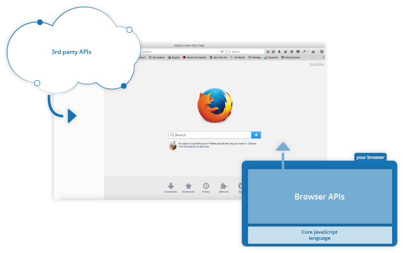

# APIs in client-side JavaScript

## 2 Types of API in JS 

1- Browser APIs :   
are built into your web browser and are able to expose data from the browser and surrounding computer environment and do useful complex things with it. For example, the (Web Audio API)[https://developer.mozilla.org/en-US/docs/Web/API/Web_Audio_API] provides JavaScript constructs for manipulating audio in the browser — taking an audio track, altering its volume, applying effects to it, etc. In the background, the browser is actually using some complex lower-level code (e.g. C++ or Rust) to do the actual audio processing. But again, this complexity is abstracted away from you by the API.
2 - Third-party APIs

